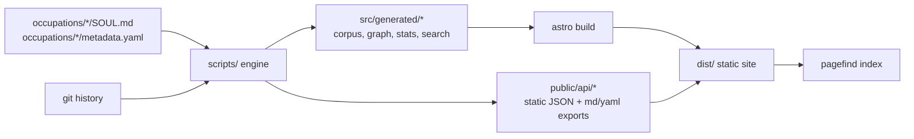

# Architecture

SOUL Atlas is a **static knowledge base**: a corpus of Markdown + YAML, a build-time
engine that derives everything from it, and an Astro website that renders the result.
There is no backend, no database, and no runtime server. This is a deliberate choice —
it makes the project cheap to host, trivial to fork, durable for decades, and fully
inspectable.

## Data flow

1. **Source of truth** — `occupations/<slug>/SOUL.md` (an H1 title and H2 sections)
   plus `metadata.yaml`. Nothing is computed by hand.
2. **The engine** (`scripts/`, plain ESM) parses, validates, renders Markdown, reads
   git history, and computes the graph + analytics.
3. **Generated artifacts** are written to `src/generated/` (for the site) and
   `public/api/` (the public API). Both are `.gitignore`d and rebuilt every time.
4. **Astro** statically renders pages, importing the generated data.
5. **Pagefind** indexes the built HTML for full-text search.

## The engine (`scripts/`)

| Module | Responsibility |
| --- | --- |
| `lib/paths.mjs` | Central paths and constants (repo, site, base path, relationship types). |
| `lib/markdown.mjs` | Markdown → HTML (via `marked`), heading/TOC extraction, word count, reading time, slugify. |
| `lib/corpus.mjs` | The core loader: read every occupation, parse sections, compute completeness, build typed edges + backlinks + the graph. |
| `lib/git.mjs` | Per-file history (created/updated/revisions/authors/timeline) and repo activity. |
| `lib/stats.mjs` | Pure analytics: category/status counts, centrality (degree + Brandes betweenness), interdisciplinarity, leaderboards, quality flags, shortest path. |
| `generate.mjs` | Orchestrates the above and writes all artifacts. |
| `validate.mjs` | Schema + section + relationship validation; the CI gate. |
| `new-occupation.mjs` | Scaffolds a new SOUL from the templates. |

The engine is intentionally **pure and decoupled** from Astro: it could feed any
front-end, or none. It has no dependency on the website.

## The website (`src/`)

- `lib/data.ts` — typed access to the generated corpus; the only bridge between the
  engine's output and the pages. Loads full records via `import.meta.glob`.
- `lib/site.ts` — site config and base-path-aware URL helpers, so the site runs at
  `/` (user page) or `/<repo>` (project page) with no code changes.
- `layouts/Layout.astro` — shared shell: SEO/OpenGraph/JSON-LD, theme (no-FOUC),
  header, footer, command palette.
- `components/` — `GraphView` (reusable D3 force graph), `CommandPalette` (⌘K fuzzy
  search), `SoulCard`, `Header`, `Footer`, `ThemeToggle`.
- `pages/` — homepage, explorer, `occupations/[slug]`, graph, dashboard, compare,
  categories, tags, search, about, plus API-adjacent endpoints (`rss.xml`,
  `feed/new.xml`, `sitemap.xml`, `robots.txt`).

## Design principles

- **Static and derivable.** If a value can be computed from the corpus, it is — never
  stored by hand. Re-running `generate` always reproduces the same artifacts.
- **One contract.** [`schema/`](schema/) is the single definition of the format.
  Tooling, validation, the website, and the API all derive from it.
- **Base-path agnostic.** All internal links go through `url()`; the site deploys to a
  user page or a project page unchanged.
- **Graceful degradation.** Git history, mermaid diagrams, and the search index all
  degrade to a sensible empty/fallback state when absent.

## Scalability

The architecture targets **10,000+ SOULs and 100,000+ edges** without redesign:

- Full per-SOUL records are written to individual files, not one monolith, so memory
  stays bounded and pages are generated independently.
- Expensive graph metrics (Brandes betweenness) are **capped by node count** and skip
  automatically on large graphs; degree centrality and interdisciplinarity always run.
- The graph view thins labels and weakens forces as node count grows.
- Search scales via Pagefind's sharded, lazy-loaded index.
- The build is embarrassingly parallel per occupation; CI can shard if needed.

The current bottleneck at very large scale would be a single full-corpus build on one
machine; the mitigation (sharded generate + incremental builds) fits the same data
model without changing the schema or the site.

## Deployment

GitHub Actions builds the site and publishes `dist/` to GitHub Pages on every push to
`main`. See [`.github/workflows/`](.github/workflows/). Because the output is fully
static, the same `dist/` can be hosted on any static host or CDN.
